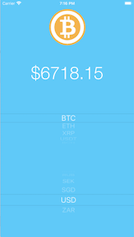
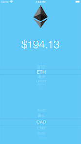

#  CryptoPrice

### Functionality

User can pick what coin to look at and in what currency. The app grabs data by making API requests to CoinMarketCap and then shows the current price of the coin.

On startup, shows the price of Bitcoin in USD like below.

An example of switching to ETH and CAD currency.

